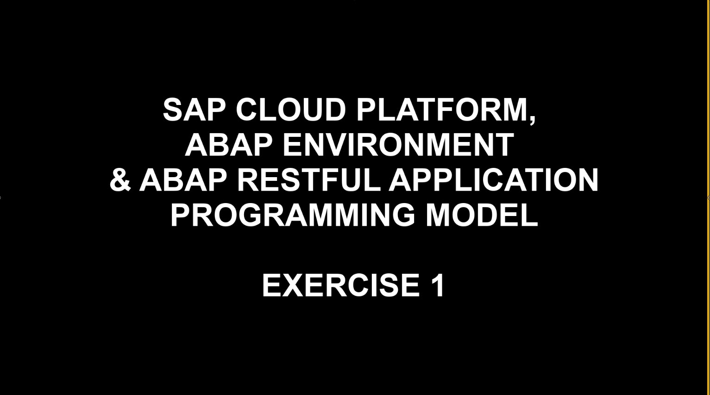
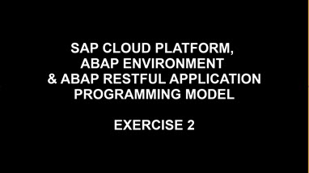
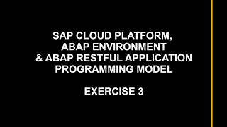

# ABAP HTTP Connectivity and ABAP RESTful Application Programming Model(RAP)

## Learning by doing

We have a set of exercises that will teach you the basic fundamentals of HTTP Connectivity and the ABAP RESTful Application Programming Model aka RAP. You can follow these exercises yourself, at your own pace, using the resources in the [ABAP Codejam](https://github.com/SAP-samples/abap-exercises-codejam) repository. You can also watch video equivalents of each of the exercises, recorded by the Developer Advocates team, where we run through each of the exercises one by one.

### Videos  

| Video | Description | Length |
| - | - | - |
|  | [Exercise 1 - Hello World](https://github.com/SAP-samples/abap-exercises-codejam/tree/master/exercises/ex1) | 8 mins |
|   | [Exercise 2 - Consuming HTTP Services](https://github.com/SAP-samples/abap-exercises-codejam/tree/master/exercises/ex2) | 11 mins |
 |   | [Exercise 3 - ABAP RESTful Application Programming Model, Unmanaged Scenario](https://github.com/SAP-samples/abap-exercises-codejam/tree/master/exercises/ex3) | 38 mins |
<!-- |   | [Exercise 4 - ABAP RESTful Application Programming Model, Managed Scenario](https://github.com/SAP-samples/abap-exercises-codejam/tree/master/exercises/ex4) | 45 mins |  -->
