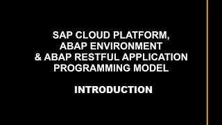

# SAP Cloud Platform, ABAP Environment & ABAP RESTful Application Programming Model(RAP)

**This enablement content is for Devtoberfest Week 2 : 31 Aug → 03 Sep 2020.**

Here you'll find content to help you level up with the [SAP Cloud Platform, ABAP Environment aka Steampunk](https://help.sap.com/viewer/65de2977205c403bbc107264b8eccf4b/Cloud/en-US/2ffdd2412aff494dbf3de31089c965d4.html) and the [ABAP RESTful Application Programming Model(RAP)](https://help.sap.com/viewer/923180ddb98240829d935862025004d6/Cloud/en-US/289477a81eec4d4e84c0302fb6835035.html). This content consists of **exercises**, **videos** of those exercises, and **office hours** sessions. 

All of the scheduled content described on this page (the premieres and the office hours session) is available in a [public Google Calendar](https://calendar.google.com/calendar?cid=Ym1ibGJucHFkOHMwcWZoYnZnMjJqazE3OWdAZ3JvdXAuY2FsZW5kYXIuZ29vZ2xlLmNvbQ) so that you can bring the events into your own calendar and get reminders for each of them. Alternatively, if you're subscribed to the [SAP Developers YouTube Channel](https://www.youtube.com/user/sapdevs) you can get reminder notifications for individual live stream and premiere videos. 

## Exercises

We have a set of exercises that help you get started with creating applications in Steampunk and leveraging the ABAP RESTful Application Prorgramming Model. They take you through a series of tasks, covering everything from creating an HTTP service and consuming an external HTTP service in ABAP, as well as a deep dive into the ABAP RESTful Application Programming Model, both the unmanaged and managed scenarios.

You can follow these exercises yourself, at your own pace, using the resources in the [ABAP Codejam](https://github.com/SAP-samples/abap-exercises-codejam) repository. 

If you have any questions when doing the exercises for this topic, you can [create an issue](https://github.com/SAP-samples/sap-devtoberfest-2020/issues/new?assignees=&labels=question%2C+topic-abap&template=exercise-question.md&title=Summarize+your+question+here) on this repository - please make sure you [use this issue template](https://github.com/SAP-samples/sap-devtoberfest-2020/issues/new?assignees=&labels=question%2C+topic-abap&template=exercise-question.md&title=Summarize+your+question+here) with the labels 'topic-abap' and 'question'. Thanks!

## Videos 

We've also recorded these exercises individually, for you to watch. We'll be airing them all for the first time on YouTube as [premieres](https://support.google.com/youtube/answer/9080341). Premieres are videos that appear initially on YouTube at a specific date and time, and the video author is usually there in the chat and available to answer questions on the content. 

For you, this means that you can set a reminder for the premieres to get notifications of when they're going live, and then join on YouTube to watch the content together, along with your fellow developers and friends, and also with the SAP Developer Advocate responsible. This means that you can chat live with them and ask questions during the event.

Don't worry if you can't make a premiere, though! After the premiere is over, the video will be available for anyone to watch at any time after that, just like a normal YouTube video (and it will keep the same URL). 

Here's what the premiere schedule looks like:

| Date / Time | Mon 31 Aug | Tue 01 Sep | Wed 02 Sep | Thu 03 Sep |
| - | - | - | - | - |
| 1100 EDT (UTC-4) | [Introduction](https://youtu.be/9wM-EyQa-5Q) | [Exercise 01](https://youtu.be/-ZxpAt8QgfM) | [Exercise 03](https://youtu.be/PYMkEhg-VTU) | [Exercise 04](https://youtu.be/xUnC0DrCF7U) | 
| 1115 EDT (UTC-4) |  | [Exercise 02](https://youtu.be/2-4jBdEXeOM) |  |  | 

## Office hours sessions

In case you have anything you want to ask or discuss, relating to the content here, we'll hold a couple of hour-long "office hours" sessions in the week following the video premieres, specifically on Wed 09 Sep. They will be in the form of Zoom meetings and scheduled to allow participation from most timezones:

- 0800 EDT (UTC-4) → [Zoom meeting link](https://sap-se.zoom.us/j/95873935644) | [ICS Download](https://sap-samples.github.io/sap-devtoberfest-2020/cal/workflow_office_hours2.ics)
- 1400 EDT (UTC-4) → [Zoom meeting link](https://sap-se.zoom.us/j/99812944506) | [ICS Download](https://sap-samples.github.io/sap-devtoberfest-2020/cal/workflow_office_hours1.ics)

These office hours sessions are also in the [public Google Calendar](https://calendar.google.com/calendar?cid=Ym1ibGJucHFkOHMwcWZoYnZnMjJqazE3OWdAZ3JvdXAuY2FsZW5kYXIuZ29vZ2xlLmNvbQ) mentioned earlier.

# The content - video & exercise links

| Video | Description | Video Length |
| - | - | - |
|  | Introduction | 18 mins | 
|  | [Exercise 1 - Hello World](https://github.com/SAP-samples/abap-exercises-codejam/tree/master/exercises/ex1) | 8 mins |
|   | [Exercise 2 - Consuming HTTP Services](https://github.com/SAP-samples/abap-exercises-codejam/tree/master/exercises/ex2) | 11 mins |
|   | [Exercise 3 - ABAP RESTful Application Programming Model, Unmanaged Scenario](https://github.com/SAP-samples/abap-exercises-codejam/tree/master/exercises/ex3) | 38 mins |
|   | [Exercise 4 - ABAP RESTful Application Programming Model, Managed Scenario](https://github.com/SAP-samples/abap-exercises-codejam/tree/master/exercises/ex4) | 34 mins |  

