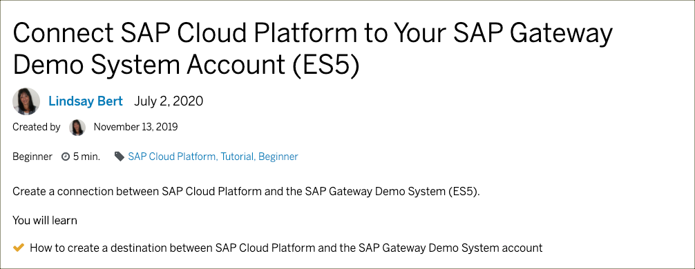
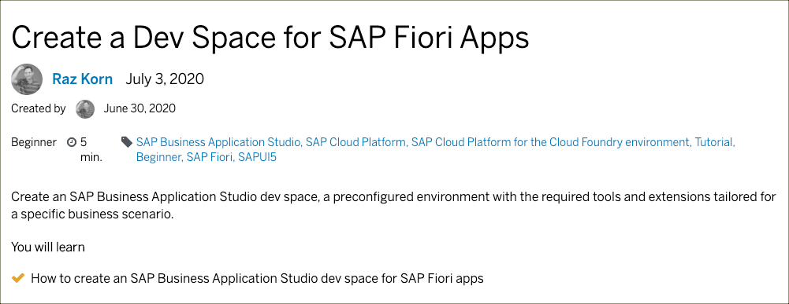

# Exercise 01 - Set the development environment up

> Before you start, please be aware that completing this exercise relies on the hardware and software  [prerequisites](../../prerequisites.md).

In this exercise, you'll create a destination for the ES5 demo system. This destination is the bridge connecting the backend system with the application we are building during the following exercises.

Additionally, you'll create a dev space in SAP Business Application Studio. Each dev space kind comes with a variable set of installed tools that will support your development activities. As all dev spaces are completely isolated environments, you have a terminal with full root access to install additional tools and editor plugins.

## Tutorials

### Tutorial 1

Click on the image to [open the tutorial](https://developers.sap.com/tutorials/cp-portal-cloud-foundry-gateway-connection.html).

### Tutorial 2

Click on the image to [open the tutorial](https://developers.sap.com/tutorials/appstudio-devspace-fiori-create.html).

## Summary

You've now finished the set up of the runtime and  design-time environment. With this, you are all set to create your first Fiori Elements app.

 
 

[Next exercise ➡](02.md)
