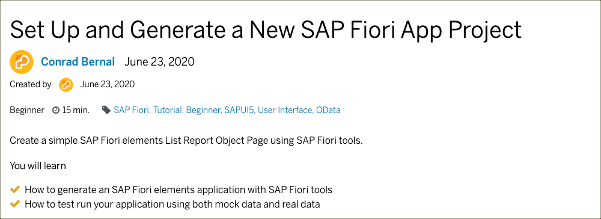
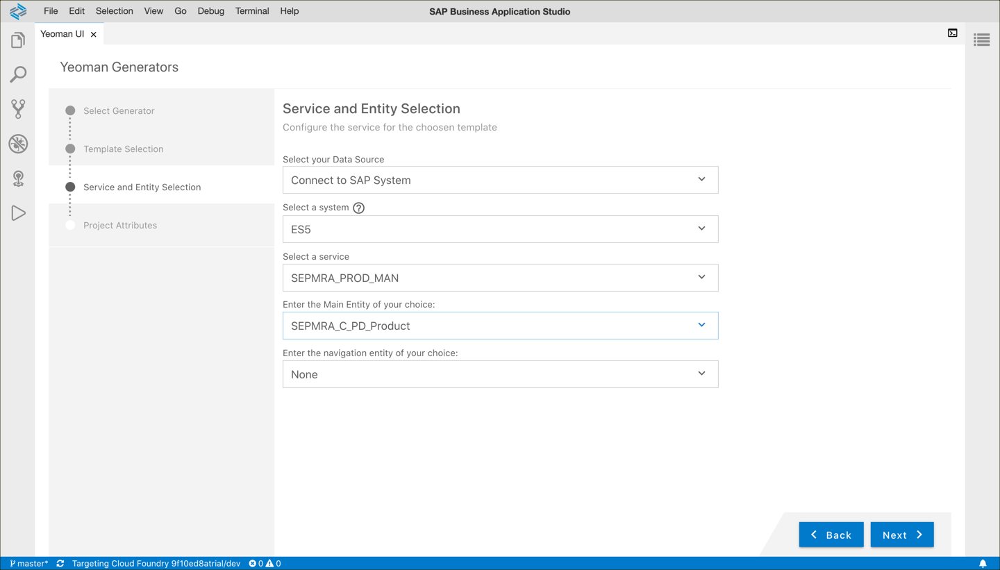
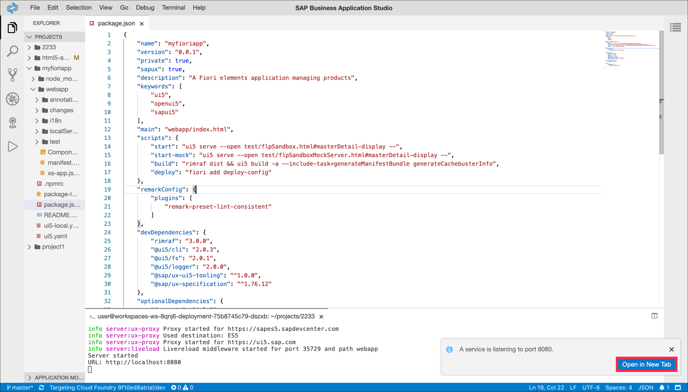
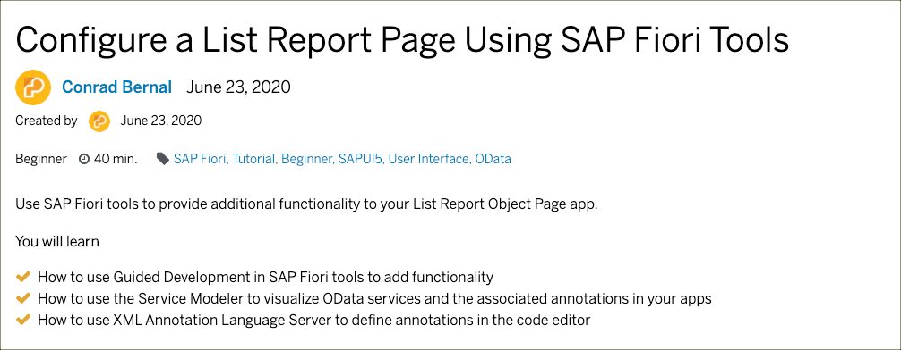
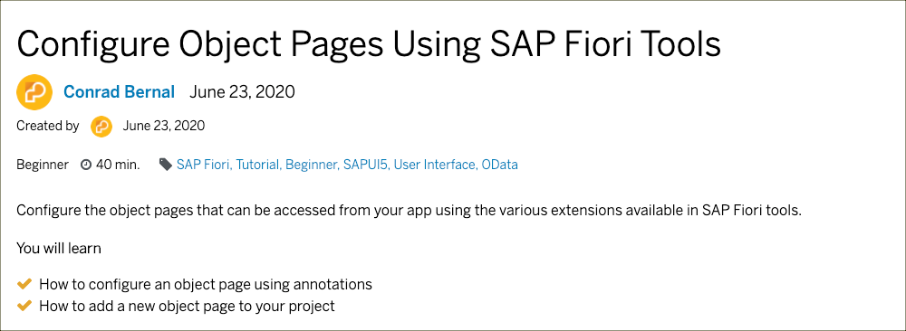

# Exercise 02 - Use the Fiori Tools to create a Fiori app

In this exercise, you'll create a Fiori Elements web app based on the OData endpoint, which is accessed via the Destination you created earlier. You'll customize the List Report page and add a new Object page with annotations to get a glimpse of the Fiori Tools' full power.

Avoid to copy and paste the snippets and **make use of the autocomplete feature** of the SAP Business Application Studio instead.

## Tutorials

### Tutorial 3

Click on the image to [open the tutorial](https://developers.sap.com/tutorials/fiori-tools-generate-project.html).

#### Step 3

Do not select **Connect to an OData Service** but instead choose the following settings:

#### Step 4
You'll see an additional input field "Choose your project folder" on this screen. Keep the default value here.

#### Step 5
Here the browser won't open up automatically (because you are already using it). Instead, you'll see a blue popup in the bottom-left corner. Click on **Open in New Tab** to get to the running web app.

### Tutorial 4

Click on the image to [open the tutorial](https://developers.sap.com/tutorials/fiori-tools-configure-lrop.html).

### Tutorial 5

Click on the image to [open the tutorial](https://developers.sap.com/tutorials/fiori-tools-configure-object-pages.html).

## Summary

You've created your first Fiori Elements app that can run with real and mock backend data. You learned how to write Fiori annotations, while supported by the XML Annotations Language Server.

 
 

[Next exercise ➡](03.md)