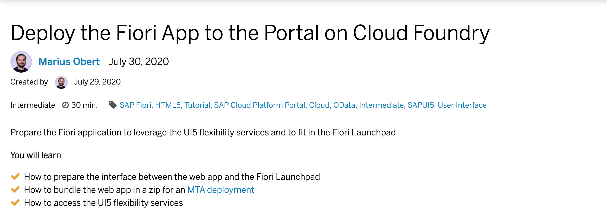

# Exercise 03 - Deploy the Fiori app to SAP Cloud Platform

In this exercise, you'll deploy the web app to the HTML5 Application Repository and embed it in a Fiori Launchpad. In the environment, the Fiori app will be able to leverage the  UI5 flexibility services fully.

## Tutorial

Click on the image to [open the tutorial](https://developers.sap.com/tutorials/sapui5-fiori-portal-deploy.html).

## Summary
You've learned how to bundle the Fiori app to link it to the launchpad service. For deployment, you cloned a sample project and replaced another web app with this bundled app. In the end, you were able to make personalization changes to the Fiori application.