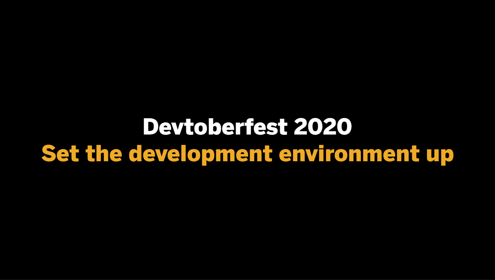
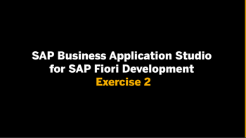
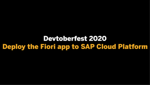

# SAP Business Application Studio for SAP Fiori Development

**This enablement content is for Devtoberfest Week 4 : Sep 14 → 18 Sep**

Here you'll find content to help you level up with the [SAP Business Application Studio](https://help.sap.com/viewer/9d1db9835307451daa8c930fbd9ab264/Cloud/en-US) service. This content consists of **exercises**, **videos** of those exercises, and **office hours** sessions.

All of the content described on this page (the premieres and the office hours session) **will be** available in a [public Google Calendar](https://calendar.google.com/calendar?cid=Ym1ibGJucHFkOHMwcWZoYnZnMjJqazE3OWdAZ3JvdXAuY2FsZW5kYXIuZ29vZ2xlLmNvbQ) so that you can bring the events into your own calendar and get reminders for each of them. Alternatively, if you're subscribed to the [SAP Developers YouTube Channel](https://www.youtube.com/user/sapdevs) you can get reminder notifications for individual live stream and premiere videos.

## Requirements

The requirements to follow the exercises in this repository, including hardware and software, are detailed in the [prerequisites](prerequisites.md) file.

## Exercises

We have a set of exercises that help you get to know the SAP Business Application Studio. They take you through a series of tasks, covering everything from setting the service up in an SAP Cloud Platform trial account, to the creation and fine-tuning of a Fiori Elements project. While doing so, you will also get to know the Fiori Tools, which are integrated into the development environment. While doing so, you will also get to know the extensibility concept of the UI5 tooling, which you could leverage for your project in the build week.

You can follow these exercises yourself, at your own pace, using the tasks that **will be** made available in the [exercises](exercises) folder in this repository.

If you have any questions when doing the exercises for this topic, you can create an issue on this repository - please make sure you [use this issue template](https://github.com/SAP-samples/sap-devtoberfest-2020/issues/new?assignees=&labels=question%2C+topic-appstudio&template=exercise-question.md&title=Summarize+your+question+here) with the labels 'topic-appstudio' and 'question'. Thanks!

## Videos 

We've also recorded these exercises individually, for you to watch. We'll be airing them all for the first time on YouTube as [premieres](https://support.google.com/youtube/answer/9080341). Premieres are videos that appear initially on YouTube at a specific date and time, and the video author is usually there in the chat and available to answer questions on the content. 

For you, this means that you can set a reminder for the premieres to get notifications of when they're going live, and then join on YouTube to watch the content together, along with your fellow developers and friends, and also with the SAP Developer Advocate responsible. This means that you can chat live with them and ask questions during the event.

Don't worry if you can't make a premiere, though! After the premiere is over, the video will be available for anyone to watch at any time after that, just like a normal YouTube video (and it will keep the same URL). 

## Office hours sessions

In case you have anything you want to ask or discuss, relating to the content here, we'll hold a couple of hour-long "office hours" sessions in the week following the video premieres, specifically on Wed 23 Sep. They will be in the form of Zoom meetings and scheduled to allow participation from most timezones:

- 0800 CEST (UTC+2) → [Zoom meeting link]
- 1400 CEST (UTC+2) → [Zoom meeting link]

These office hours sessions **will also be** in the [public Google Calendar](https://calendar.google.com/calendar?cid=Ym1ibGJucHFkOHMwcWZoYnZnMjJqazE3OWdAZ3JvdXAuY2FsZW5kYXIuZ29vZ2xlLmNvbQ) mentioned earlier.

## The content - video & exercise links

| Video | Description | Video Length | 
| - | - | - |
|  | [Exercise 1 - Set the development environment up](exercises/01.md)   Premieres on Tue 15 Sep  |  |
|  | [Exercise 2 -  Use the Fiori Tools to create a Fiori app](exercises/02.md)   Premieres on Tue 15 Sep  |
|  | [Exercise 3 - Deploy the Fiori app to SAP Cloud Platform ](exercises/03.md)   Premieres on Thu 17 Sep |  |
