# SAP Cloud Application Programming Model

**This enablement content is for Devtoberfest Week 3 : 7 September → 11 September 2020.**

Here you'll find content to help you level up with the [SAP Cloud Application Programming Model](https://cap.cloud.sap).

## Learning by doing

In a series of videos the SAP Developer Advocates will not only introduce you to the Big Picture and the concepts of the SAP Cloud Application Programming Model (CAP), they'll also explain the steps to build your first standalone application. You will start with a very rudimentary data model and simple OData services, and then make enhancements with some server-side JavaScript (Node.js) to implement your own business logic. Finally, you'll use different database systems such as SQLite and SAP HANA Cloud for storing your data and use SAP Cloud Platform as the target runtime environment for your first CAP application. 

If you have any questions when doing the exercises for this topic, you can [create an issue](https://github.com/SAP-samples/sap-devtoberfest-2020/issues/new?assignees=&labels=question%2C+topic-cap&template=exercise-question.md&title=Summarize+your+question+here) on this repository - please make sure you [use this issue template](https://github.com/SAP-samples/sap-devtoberfest-2020/issues/new?assignees=&labels=question%2C+topic-cap&template=exercise-question.md&title=Summarize+your+question+here) with the labels 'topic-cap' and 'question'. Thanks!

The videos are based on a series of exercises. You can follow these exercises yourself by watching the videos below, where we run through each step of each exercise. 

### Videos

We've also recorded these exercises individually, for you to watch. We'll be airing them all for the first time on YouTube as [premieres](https://support.google.com/youtube/answer/9080341). Premieres are videos that appear initially on YouTube at a specific date and time, and the video author is usually there in the chat and available to answer questions on the content. 

For you, this means that you can set a reminder for the premieres to get notifications of when they're going live, and then join on YouTube to watch the content together, along with your fellow developers and friends, and also with the SAP Developer Advocate responsible. This means that you can chat live with them and ask questions during the event.

Don't worry if you can't make a premiere, though! After the premiere is over, the video will be available for anyone to watch at any time after that, just like a normal YouTube video (and it will keep the same URL). 

Here's what the premiere schedule looks like:

| Date / Time      | Mon 7 Sep        | Tue 8 Sep       | Wed 9 Sep       | Thu 10 Sep      | Fri 11 Sep      |
| ---------------- | ---------------- | --------------- | --------------- | --------------- | --------------- |
| 0900 EDT (UTC-4) | [Introduction]() | [Exercise 03]() | [Exercise 05]() | [Exercise 07]() | [Exercise 09]() |
| 0930 EDT (UTC-4) | [Exercise 01]()  | [Exercise 04]() | [Exercise 06]() | [Exercise 08]() | [Exercise 10]() |
| 0945 EDT (UTC-4) | [Exercise 02]()  |                 |                 |                 |                 |

| Video                                                                               | Description                                                                                               | Length  |
| ----------------------------------------------------------------------------------- | --------------------------------------------------------------------------------------------------------- | ------- |
| [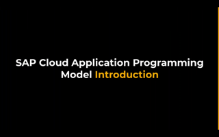](https://youtu.be/T1gqalbwzHk)                    | [SAP Cloud Application Programming Model - The Big Picture](https://youtu.be/T1gqalbwzHk)                 | 24 mins |
| [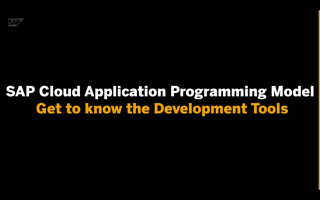](https://youtu.be/Qr7W78UA4Zo)                     | [Exercise 01 - Get to know the Development Tools](https://youtu.be/Qr7W78UA4Zo)                           | 06 mins |
| [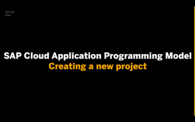](https://youtu.be/GOv8LqKQnmw)                     | [Exercise 02 - Create a new CAP project ]((https://youtu.be/GOv8LqKQnmw))                                 | 12 mins |
| [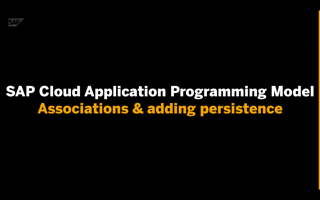](https://youtu.be/0F2_gqDNcbI)                     | [Exercise 03 - Associations & adding persistence](https://youtu.be/0F2_gqDNcbI)                           | 12 mins |
| [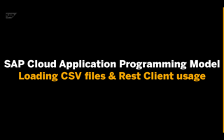](https://youtu.be/VGmeUtCnSKU)                     | [Exercise 04 - Loading CSV files & Rest Client usage](https://youtu.be/VGmeUtCnSKU)                       | 08 mins |
| [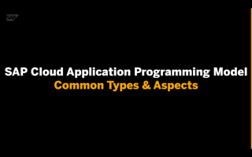](https://youtu.be/fBo6ru4_s_0)                     | [Exercise 05 - Common Types & Aspects](https://youtu.be/fBo6ru4_s_0)                                      | tbd     |
| [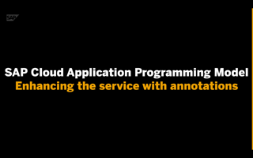](https://youtu.be/STJWlinoPYY)                     | [Exercise 06 - Enhancing the service with annotations](https://youtu.be/STJWlinoPYY)                      | 09 mins |
| [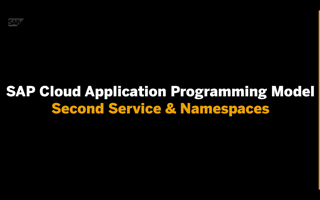](https://youtu.be/g4YblJKUAVQ)                     | [Exercise 07 - Second Service & Namespaces](https://youtu.be/g4YblJKUAVQ)                                 | tbd     |
| [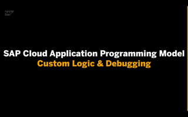](https://youtu.be/1snsOK5Tq2Y)                     | [Exercise 08 - Custom Logic & Debugging](https://youtu.be/1snsOK5Tq2Y)                                    | 14 mins |
| [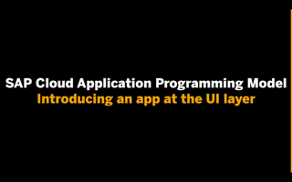](https://youtu.be/2ySplQUIpvk)                     | [Exercise 09 - Introducing an app at the UI layer](https://youtu.be/2ySplQUIpvk)                          | 20 mins |
|                     | [Exercise 10 - Deploy to SAP Cloud Platform and SAP HANA Cloud](https://youtu.be/YwNdBSfZdjU)             | 28 mins |
| [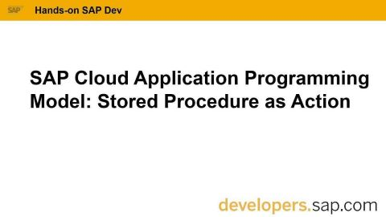](https://www.youtube.com/watch?v=wdfJ4ZP4aQs) | [Bonus Video - Stored Procedure as Action](https://www.youtube.com/watch?v=wdfJ4ZP4aQs)  Available Now | 20 mins |

## Office hours sessions

In case you have anything you want to ask or discuss, relating to the content here, we'll hold a couple of hour-long "office hours" sessions in the week following the video premieres, specifically on Wed 16 Sep. They will be in the form of Zoom meetings and scheduled to allow participation from most timezones:

- 0300 EDT (UTC-4) → [Zoom meeting link](https://sap-se.zoom.com/j/92815359419) | [ICS Download](https://sap-samples.github.io/sap-devtoberfest-2020/cal/cap_office_hours1.ics)
- 1200 EDT (UTC-4) → [Zoom meeting link](https://sap-se.zoom.us/j/94809437003) | [ICS Download](https://sap-samples.github.io/sap-devtoberfest-2020/cal/cap_office_hours2.ics)

These office hours sessions are also in the [public Google Calendar](https://calendar.google.com/calendar?cid=Ym1ibGJucHFkOHMwcWZoYnZnMjJqazE3OWdAZ3JvdXAuY2FsZW5kYXIuZ29vZ2xlLmNvbQ) mentioned earlier.
