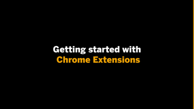

# Google Chrome Extensions

Here you'll find content to help you get started creating Google Chrome Extensions.

## Learning from examples

This enablement session gives you insight into where Google Chrome Extensions make sense and how to get started building them. Jeffrey Groneberg, Principal Cloud Solution Architect at SAP, shares with you his experience gained during the development of his first Google Chrome Extension. Among other things, he talks about how he got started, where learning resources can be found and what stumbling blocks he identified.

The focus of this enablement session is to provide some first impressions and perhaps to inspire you to build your own.

## Parts

| Video                                                                                | Description                                                                                                   | Length  |
| ------------------------------------------------------------------------------------ | ------------------------------------------------------------------------------------------------------------- | ------- |
|  | Building your first Chrome extension with Jeffrey Groneberg Premieres on Friday 2 Oct at 2PM CEST (UTC+2) [ICS Download](https://sap-samples.github.io/sap-devtoberfest-2020/cal/chrome_extensions.ics) | 37 mins |
