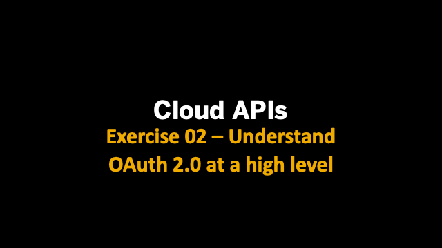
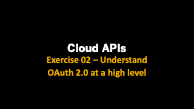
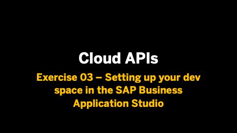
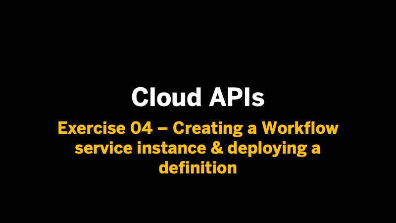
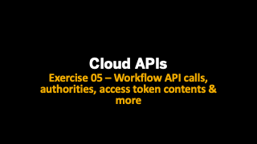
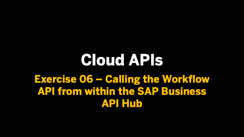

# Cloud APIs

**This enablement content is for Devtoberfest Week 6 : 28 Sep → 02 Oct 2020.**

Here you'll find content to help you level up with the Cloud APIs, on SAP Cloud Platform. This content consists of **exercises**, **videos** of those exercises, and **office hours** sessions. 

All of the scheduled content described on this page (the premieres and the office hours session) is available in a [public Google Calendar](https://calendar.google.com/calendar?cid=Ym1ibGJucHFkOHMwcWZoYnZnMjJqazE3OWdAZ3JvdXAuY2FsZW5kYXIuZ29vZ2xlLmNvbQ) so that you can bring the events into your own calendar and get reminders for each of them. Alternatively, if you're subscribed to the [SAP Developers YouTube Channel](https://www.youtube.com/user/sapdevs) you can get reminder notifications for individual live stream and premiere videos. 

## Exercises

We have a [set of exercises that help you learn about Cloud APIs](https://github.com/SAP-samples/cloud-apis-virtual-event/). In the first part, you'll get an overview of API resources on SAP Cloud Platform, and also we'll help you understand OAuth 2.0 which is essential when it comes to protecting and using cloud APIs. In the second part, we take a deep dive into a specific set of APIs (for SAP Cloud Platform Workflow). What's important is not the fact that the APIs are related to Workflow or anything else; what's important is that you:

- learn how you can set up your own development space in the SAP Business Application Studio with tools that will help you explore and call the APIs
- understand how to request access tokens and deal with authorization issues
- discover what's inside an access token and how to influence that
- know how to use the SAP Business API Hub to set up your own API environment

You can follow these exercises yourself, at your own pace, using the resources in the [Virtual Event - Cloud APIs](https://github.com/SAP-samples/cloud-apis-virtual-event/) repository. 

If you have any questions when doing the exercises for this topic, you can [create an issue](https://github.com/SAP-samples/sap-devtoberfest-2020/issues/new?assignees=&labels=question%2C+topic-cloud-apis&template=exercise-question.md&title=Summarize+your+question+here) on this repository - please make sure you [use this issue template](https://github.com/SAP-samples/sap-devtoberfest-2020/issues/new?assignees=&labels=question%2C+topic-cloud-apis&template=exercise-question.md&title=Summarize+your+question+here) with the labels 'topic-cloud-apis' and 'question'. Thanks!

## Videos 

We've also recorded these exercises individually, for you to watch. We'll be airing them all for the first time on YouTube as [premieres](https://support.google.com/youtube/answer/9080341). Premieres are videos that appear initially on YouTube at a specific date and time, and the video author is usually there in the chat and available to answer questions on the content. 

For you, this means that you can set a reminder for the premieres to get notifications of when they're going live, and then join on YouTube to watch the content together, along with your fellow developers and friends, and also with the SAP Developer Advocate responsible. This means that you can chat live with them and ask questions during the event.

Don't worry if you can't make a premiere, though! After the premiere is over, the video will be available for anyone to watch at any time after that, just like a normal YouTube video (and it will keep the same URL). 

Here's what the premiere schedule looks like - note that there are different lengths and start times for each video premiere (currently all times are approximate):
Here's what the premiere schedule looks like:

| Date / Time      | Mon 28 Sep        | Tues 29 Sep       | Wed 30 Sep  | Thurs 1 Oct |
| ---------------- | ---------------- | --------------- | --------------- | --------------- |
| 1100 BST (UTC+1) | [Exercise 01](https://youtu.be/efnYDfEwqDs) | [Exercise 03](https://youtu.be/FvYyQQiKzmQ) | | [Exercise 05]() |
| 1115 BST (UTC+1) | [Exercise 02](https://youtu.be/ie3V0HuJg8M) | [Exercise 04]() |  
| 1130 BST (UTC+1) | | | | [Exercise 06]() |

| Video | Description | Video Length |
| - | - | - |
|   | [Exercise 01 - Get an overview of API resources](https://github.com/SAP-samples/cloud-apis-virtual-event/tree/main/exercises/01/readme.md)    [Premieres](https://youtu.be/efnYDfEwqDs) on Mon 28 Sep at 1100 BST (UTC+1)  [ICS Download](https://sap-samples.github.io/sap-devtoberfest-2020/cal/cloud_apis_ex1.ics) | 12 mins |
|   | [Exercise 02 - Understand OAuth 2.0 at a high level](https://github.com/SAP-samples/cloud-apis-virtual-event/tree/main/exercises/02/readme.md)    [Premieres](https://youtu.be/ie3V0HuJg8M) on Mon 28 Sep at 1115 BST (UTC+1)  [ICS Download](https://sap-samples.github.io/sap-devtoberfest-2020/cal/cloud_apis_ex2.ics) | 16 mins |
|   | [Exercise 03 - Setting up your dev space in App Studio](https://github.com/SAP-samples/cloud-apis-virtual-event/tree/main/exercises/03/readme.md)    [Premieres](https://youtu.be/FvYyQQiKzmQ) on Tue 29 Sep at 1100 BST (UTC+1)  [ICS Download](https://sap-samples.github.io/sap-devtoberfest-2020/cal/cloud_apis_ex3.ics) | 14 mins |
|   | [Exercise 04 - Creating a Workflow service instance & deploying a definition](https://github.com/SAP-samples/cloud-apis-virtual-event/tree/main/exercises/04/readme.md)    [Premieres](https://youtu.be/8vQIEwAZcqw) on Tue 29 Sep at 1115 BST (UTC+1)  [ICS Download](https://sap-samples.github.io/sap-devtoberfest-2020/cal/cloud_apis_ex4.ics) | 13 mins |
|   | [Exercise 05 - Workflow API calls, authorities, access token contents & more](https://github.com/SAP-samples/cloud-apis-virtual-event/tree/main/exercises/05/readme.md)    [Premieres](https://youtu.be/) on Thu 01 Oct at 1100 BST (UTC+1)  [ICS Download](https://sap-samples.github.io/sap-devtoberfest-2020/cal/cloud_apis_ex5.ics) | nn mins |
|   | [Exercise 06 - Calling the Workflow API from within the API Hub](https://github.com/SAP-samples/cloud-apis-virtual-event/tree/main/exercises/06/readme.md)    [Premieres](https://youtu.be/) on Thu 01 Oct at 1130 BST (UTC+1)  [ICS Download](https://sap-samples.github.io/sap-devtoberfest-2020/cal/cloud_apis_ex6.ics) | nn mins |

## Office hours sessions

In case you have anything you want to ask or discuss, relating to the content here, we'll hold a couple of hour-long "office hours" sessions in the week following the video premieres, specifically on **Wed 07 Oct**. They will be in the form of Zoom meetings and scheduled to allow participation from most timezones:

- 0800 BST (UTC+1) → [Zoom meeting link](https://sap-se.zoom.us/j/97591864805) | [ICS Download](https://sap-samples.github.io/sap-devtoberfest-2020/cal/cloud_apis_office_hours1.ics)
- 1400 BST (UTC+1) → [Zoom meeting link](https://sap-se.zoom.us/j/94828077650) | [ICS Download](https://sap-samples.github.io/sap-devtoberfest-2020/cal/cloud_apis_office_hours2.ics)

These office hours sessions are also in the [public Google Calendar](https://calendar.google.com/calendar?cid=Ym1ibGJucHFkOHMwcWZoYnZnMjJqazE3OWdAZ3JvdXAuY2FsZW5kYXIuZ29vZ2xlLmNvbQ) mentioned earlier.

