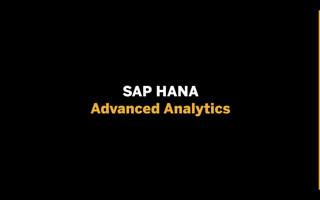
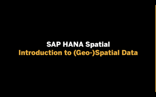
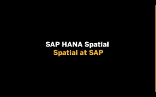
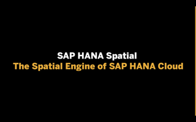
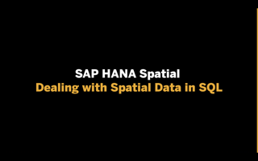
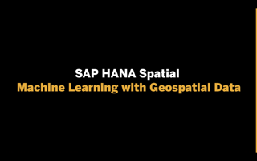
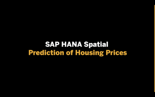
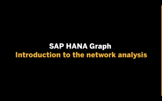
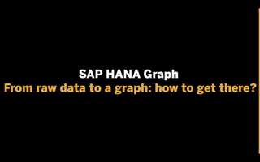

# SAP HANA Multi-model

Here you'll find content to help you level up with the [SAP HANA Multi-model](https://www.sap.com/products/hana/features/multi-model.html) capabilities.

**SAP HANA’s Spatial Engine** allows you to process and analyze spatial data like a geo-ninja. Learn how to handle geo-spatial data and derive advanced insights on an SQL level. Since SAP HANA is following the OGC standards, you will be easily able to visualize your work on almost any map.

Networks are all around us - road networks, social networks, supplier networks, communication networks etc. The **SAP HANA Graph engine** allows you to model, process, and analyze connected data. Learn how to work with graphs within the SAP HANA database.

## Get started...

...with the trial of SAP HANA Cloud and its multi-model capabilities using the tutorial: https://developers.sap.com/tutorials/hana-trial-advanced-analytics.html

## Videos with presentations and demos

Here's what the premiere schedule looks like:

| Date / Time      | Mon 21 Sep        | Tue 22 Sep       | Wed 23 Sep       | Thu 24 Sep      |
| ---------------- | ---------------- | --------------- | --------------- | --------------- |
| 1500 CEST (UTC+2) | [Do you know SAP HANA Advanced Analytics?](https://youtu.be/OkPMdbn1vBs) | [Introduction to (Geo-)Spatial Data](https://youtu.be/s48iAbBrYBI) | [Dealing with Spatial Data in SQL [demo]](https://youtu.be/6dh_Hj6d9xM) | [Introduction to the network analysis](https://youtu.be/_JnKtv66E-w) |
| 1515 CEST (UTC+2) |  | [Spatial at SAP](https://youtu.be/W-3th2mhJA4)  | | [From raw data to a graph: how to get there?](https://youtu.be/tCPTr0q-tUQ)               |
| 1530 CEST (UTC+2) |  | [The Spatial Engine of SAP HANA Cloud](https://youtu.be/uxNxFWmTTP4) | [Machine Learning with Geospatial Data](https://youtu.be/Jv1BIMpxoR4)  | [The SAP HANA Graph engine basics](https://youtu.be/b7fEUj-1Igg) |
| 1545 CEST (UTC+2) | | | [Prediction of Housing Prices demo](https://youtu.be/9nF8ergZf-o) | [Core graph procedures and advanced use cases](https://youtu.be/765Z980kR5U) |

| Video | Description | Length |
| - | - | - |
|  | **Do you know SAP HANA Advanced Analytics?**  Premiered on: Mon, Sep 21 | 36 mins |
|  | **Introduction to (Geo-)Spatial Data**  Premiers on: Tue, Sep 22 at 15:00 CEST (UTC+2)  [ICS Download](https://sap-samples.github.io/sap-devtoberfest-2020/cal/hana_2.ics) | 6 mins |
|  | **Spatial at SAP**  Premiers on: Tue, Sep 22 at 15:15 CEST (UTC+2)   [ICS Download](https://sap-samples.github.io/sap-devtoberfest-2020/cal/hana_3.ics) | 7 mins |
|  | **The Spatial Engine of SAP HANA Cloud**  Premiers on: Tue, Sep 22 at 15:30 CEST (UTC+2)  [ICS Download](https://sap-samples.github.io/sap-devtoberfest-2020/cal/hana_4.ics) | 16 mins |
|  | **Dealing with Spatial Data in SQL [demo]**  Premiers on: Wed, Sep 23 at 15:00 CEST (UTC+2)  [ICS Download](https://sap-samples.github.io/sap-devtoberfest-2020/cal/hana_5.ics) | 19 mins |
|  | **Machine Learning with Geospatial Data**  Premiers on: Wed, Sep 23 at 15:30 CEST (UTC+2)  [ICS Download](https://sap-samples.github.io/sap-devtoberfest-2020/cal/hana_6.ics) | 9 mins |
|  | **Prediction of Housing Prices [demo]**  Premiers on: Wed, Sep 23 at 15:45 CEST (UTC+2)  [ICS Download](https://sap-samples.github.io/sap-devtoberfest-2020/cal/hana_7.ics) | 31 mins |
|  | **Introduction to the network analysis**  Premiers on: Thu, Sep 24 at 15:00 CEST (UTC+2)  [ICS Download](https://sap-samples.github.io/sap-devtoberfest-2020/cal/hana_8.ics) | 11 mins |
|  | **From raw data to a graph: how to get there?**  Premiers on: Thu, Sep 24 at 15:15 CEST (UTC+2)  [ICS Download](https://sap-samples.github.io/sap-devtoberfest-2020/cal/hana_9.ics) | 10 mins |
|  | **The SAP HANA Graph engine basics**  Premiers on: Thu, Sep 24 at 15:30 CEST (UTC+2)  [ICS Download](https://sap-samples.github.io/sap-devtoberfest-2020/cal/hana_10.ics) | 14 mins |
|  | **Core graph procedures and advanced use cases**  Premiers on: Thu, Sep 24 at 15:45 CEST (UTC+2)  [ICS Download](https://sap-samples.github.io/sap-devtoberfest-2020/cal/hana_11.ics) | 28 mins |

## Office hours sessions

In case you have anything you want to ask or discuss, relating to the content here, we'll hold a couple of hour-long "office hours" sessions in the week following the video premieres, specifically on Wed 30 Sep. They will be in the form of Zoom meetings and scheduled to allow participation from most timezones:

- 0800 CEST (UTC+2) → [Zoom meeting link](https://sap-se.zoom.us/j/96414122925) | [ICS Download](https://sap-samples.github.io/sap-devtoberfest-2020/cal/hana_office_hours1.ics)
- 1400 CEST (UTC+2) → [Zoom meeting link](https://sap-se.zoom.us/j/96556204729) | [ICS Download](https://sap-samples.github.io/sap-devtoberfest-2020/cal/hana_office_hours2.ics)

These office hours sessions **will also be** in the [public Google Calendar](https://calendar.google.com/calendar?cid=Ym1ibGJucHFkOHMwcWZoYnZnMjJqazE3OWdAZ3JvdXAuY2FsZW5kYXIuZ29vZ2xlLmNvbQ) mentioned earlier.
