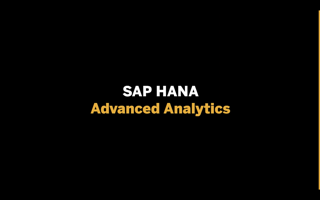

# SAP HANA Multi-model

Here you'll find content to help you level up with the [SAP HANA Multi-model](https://www.sap.com/products/hana/features/multi-model.html) capabilities.

## Learning from examples

**SAP HANA’s Spatial Engine** allows you to process and analyze spatial data like a geo-ninja. Learn how to handle geo-spatial data and derive advanced insights on an SQL level. Since SAP HANA is following the OGC standards, you will be easily able to visualize your work on almost any map.

Networks are all around us - road networks, social networks, supplier networks, communication networks etc. The **SAP HANA Graph engine** allows you to model, process, and analyze connected data. Learn how to work with graphs within the SAP HANA database.

## Parts

| Video                                                                               | Description                                                                                               | Length  |
| ----------------------------------------------------------------------------------- | --------------------------------------------------------------------------------------------------------- | ------- |
|                      | Do you know SAP HANA Advanced Analytics?  Premiers on: date and time tba   | 41 mins |
|-|SAP HANA's Spatial Engine| tba |
|-|SAP HANA's Graph Engine| tba |
