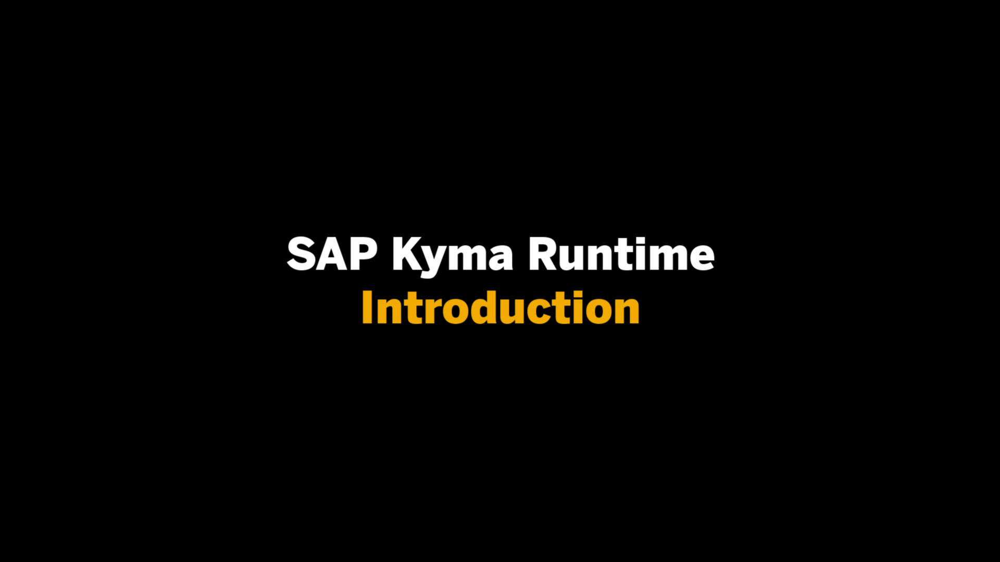
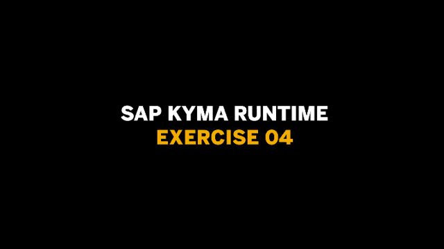
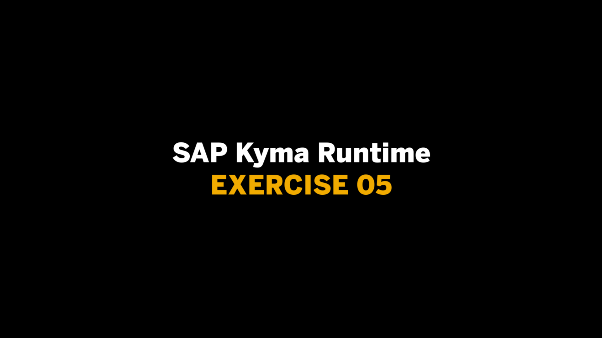
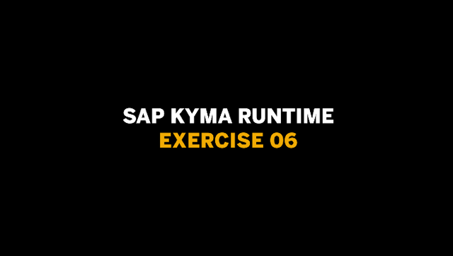

# SAP Kyma Runtime

Here you'll find content to help you level up with the Kyma runtime:

- [Kyma Project](https://kyma-project.io)
- [SAP Cloud Platform Extension Factory, Kyma runtime](https://discovery-center.cloud.sap/protected/index.html#/serviceCatalog/1b320a69-c013-417c-bf55-2683299777c6)
- [Thomas Hertz - Get a fully managed runtime based on Kyma and Kubernetes](https://blogs.sap.com/2020/05/12/get-a-fully-managed-runtime-based-on-kyma-and-kubernetes/)

## Learning by doing

What is Kyma??? - Kyma /kee-ma/ is a platform for extending applications with serverless functions and microservices. It provides a selection of cloud-native projects glued together to simplify the creation and management of extensions.  

This series of instructional videos will introduce you to the Kyma Open Source Runtime. During the course of these exercises you will learn not only what Kyma is but also how to setup Kyma locally on your machine as well as on an Hyper-Scaler. You will experience how you can successfully deploy to the Kyma environment and extend it through different services.

In an additional exercise you will get walked through how you can connect an SAP Cloud Platform Fiori for iOS SDK app to your Kyma deployed APIs and consume data through SAP Cloud Platform Mobile Services.

Get ready and excited for some Kyma-ing!

### Videos  

| Video | Description | Length |
| - | - | - |
|   | [What is Kyma?](https://github.com/SAP-samples)                                                  | - |
|     | [Exercise 1 - Setup a local Kyma installment](https://github.com/SAP-samples)                    | - |
|     | [Exercise 2 - Run Kyma on a Hyper-Scaler](https://github.com/SAP-samples)                        | - |
|     | [Exercise 3 - How to deploy to the Kyma Environment](https://github.com/SAP-samples)             | - |
|     | [Exercise 4 - Expose your Service through an Oauth2 secured API](https://github.com/SAP-samples) | - |
|     | [Exercise 5 - Create extensions to get Additional Services](https://github.com/SAP-samples)      | - |
|     | [Exercise 6 - Prepare your Kyma environment for Scale](https://github.com/SAP-samples)           | - |
|   | [SAP Cloud Platform Extension Factory, Kyma runtime](https://github.com/SAP-samples) | - |
|         | [Challenge - Consume a Kyma exposed API in your iOS app](https://github.com/SAP-samples)          | - |
