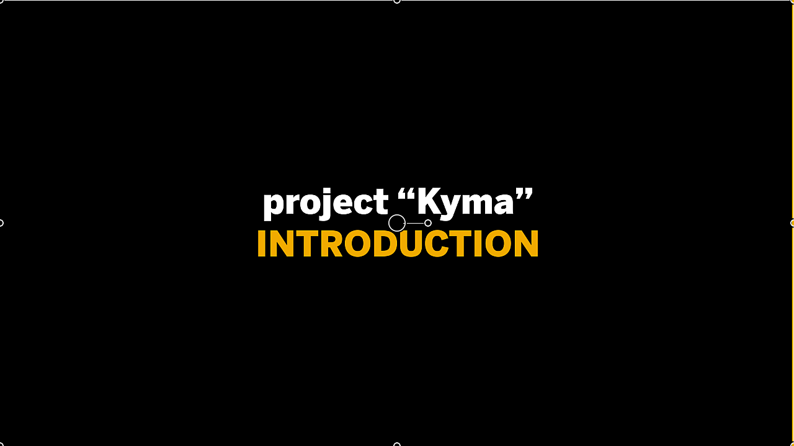
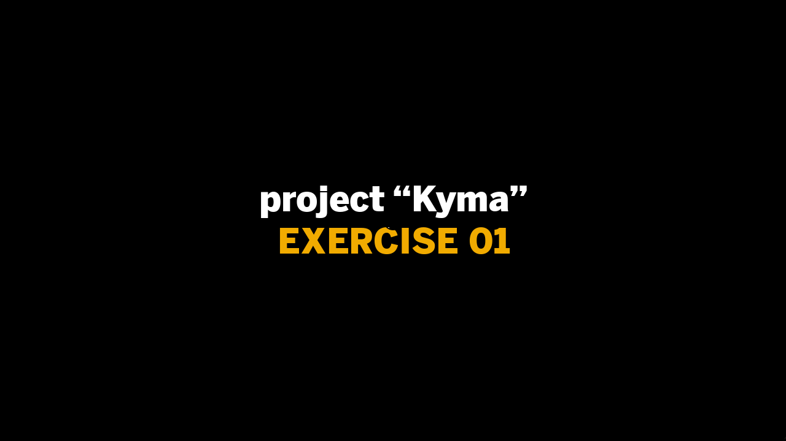
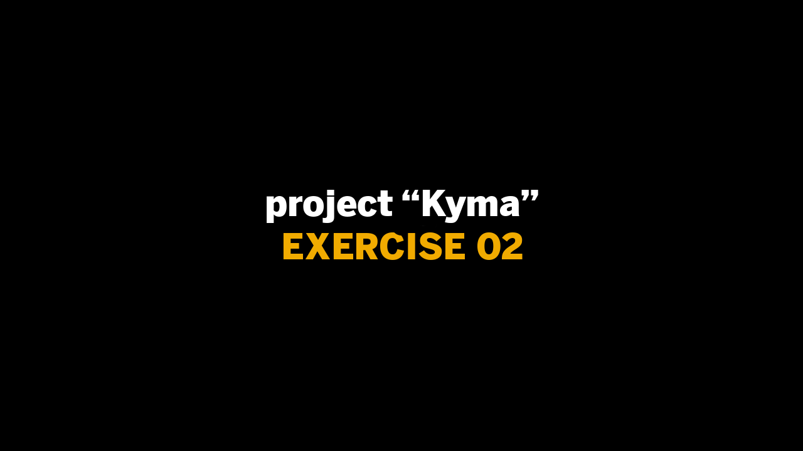
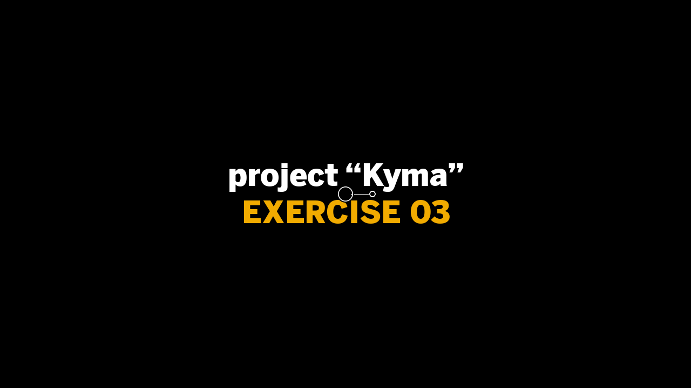
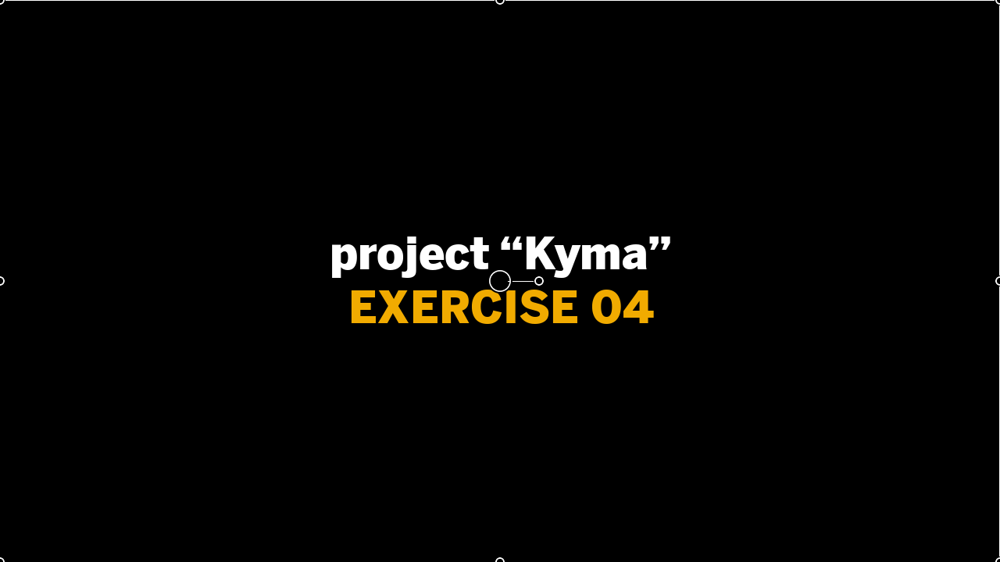
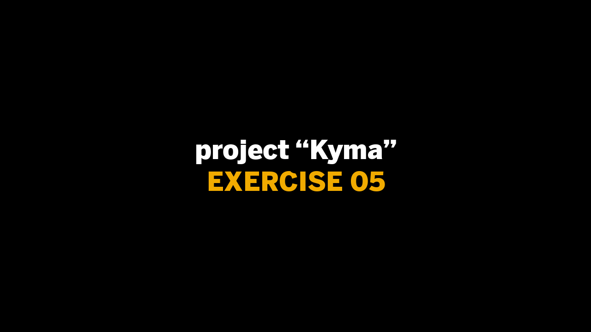
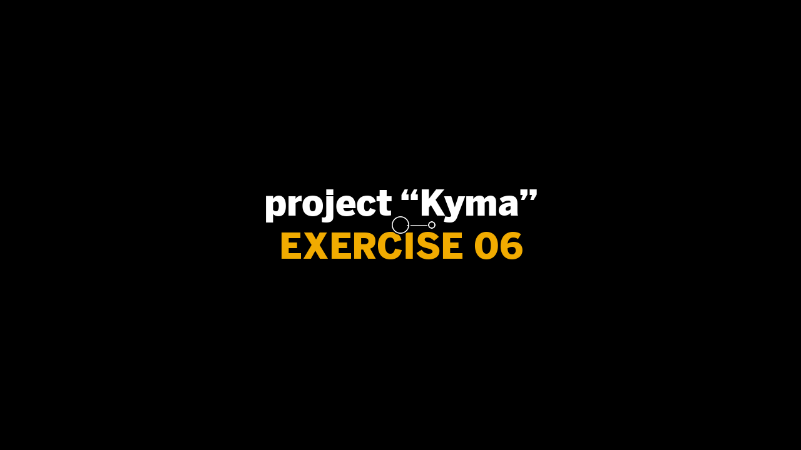
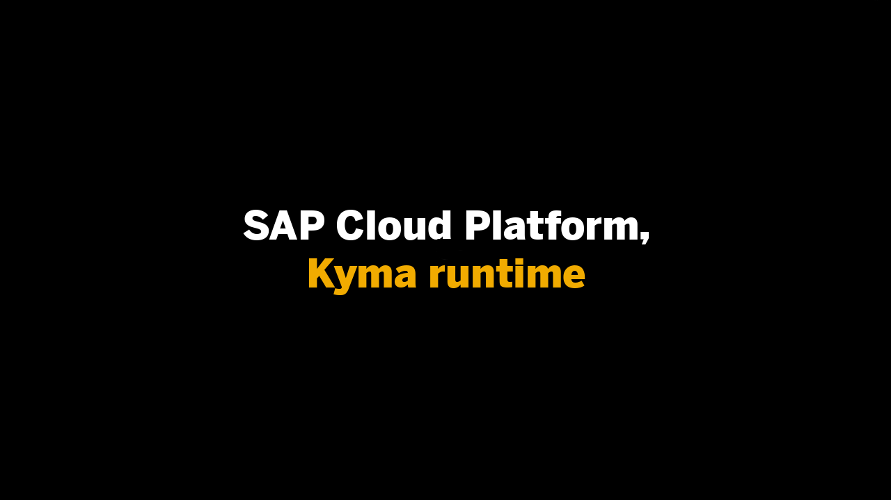

# project "Kyma"

**This enablement content is for Devtoberfest Week 7: 05 Oct → 09 Oct 2020.**

Here you'll find content to help you level up with the [project "Kyma"](https://kyma-project.io). This content consists of **exercises**, **videos** of those exercises, and **office hours** sessions.

- [project "Kyma"](https://kyma-project.io)
- [SAP Cloud Platform, Kyma runtime](https://discovery-center.cloud.sap/protected/index.html#/serviceCatalog/1b320a69-c013-417c-bf55-2683299777c6)
- [Thomas Hertz - Get a fully managed runtime based on Kyma and Kubernetes](https://blogs.sap.com/2020/05/12/get-a-fully-managed-runtime-based-on-kyma-and-kubernetes/)
- [Kyma – A Flexible Way to Connect and Extend Applications](https://open.sap.com/courses/kyma1)

All of the scheduled content described on this page (the premieres and the office hours session) is available in a [public Google Calendar](https://calendar.google.com/calendar?cid=Ym1ibGJucHFkOHMwcWZoYnZnMjJqazE3OWdAZ3JvdXAuY2FsZW5kYXIuZ29vZ2xlLmNvbQ) so that you can bring the events into your own calendar and get reminders for each of them. Alternatively, if you're subscribed to the [SAP Developers YouTube Channel](https://www.youtube.com/user/sapdevs) you can get reminder notifications for individual live stream and premiere videos.

## Exercises

We have a set of exercises that help you get to know the open source Kyma project as well as an introduction into the [SAP Cloud Platform, Kyma runtime](https://discovery-center.cloud.sap/serviceCatalog/1b320a69-c013-417c-bf55-2683299777c6).
They take you through a series of tasks, covering everything from a basic overview and introduction, through setting up a local Kyma installment as well as using a Hyperscaler, interaction and development for the Kyma runtime. You will learn how to utilize different services to extend your application deployments and how to make your application scalable.

You can follow these exercises yourself, at your own pace, using the resources in the [Virtual Event - kyma-runtime-virtual-event](https://github.com/SAP-samples/kyma-runtime-virtual-event) repository.

If you have any questions when doing the exercises for this topic, you can [create an issue](https://github.com/SAP-samples/sap-devtoberfest-2020/issues/new?assignees=&labels=question&template=exercise-question.md&title=Summarize+your+question+here) on this repository - please make sure you [use this issue template](https://github.com/SAP-samples/sap-devtoberfest-2020/issues/new?assignees=&labels=question&template=exercise-question.md&title=Summarize+your+question+here) with the labels 'topic-kyma' and 'question'. Thanks!

## Videos

We've also recorded these exercises individually, for you to watch. We'll be airing them all for the first time on YouTube as [premieres](https://support.google.com/youtube/answer/9080341). Premieres are videos that appear initially on YouTube at a specific date and time, and the video author is usually there in the chat and available to answer questions on the content.

For you, this means that you can set a reminder for the premieres to get notifications of when they're going live, and then join on YouTube to watch the content together, along with your fellow developers and friends, and also with the SAP Developer Advocate responsible. This means that you can chat live with them and ask questions during the event.

Don't worry if you can't make a premiere, though! After the premiere is over, the video will be available for anyone to watch at any time after that, just like a normal YouTube video (and it will keep the same URL).

We've scheduled the premieres for the videos of these 6 exercises over 5 consecutive days in October - One to Two a day, between Mon 05 Oct and Fri 09 Oct. The exact time schedule will be released shortly.
<!--They'll be at the same time on each of those days, contained in a one-hour block starting at 1100 BST (UTC+1). Note that each exercise video is less than 30 mins in length, meaning that we can use the time between the end of the first video and the start of the second (at 1130) to continue the chat if necessary. -->

Here's what the premiere schedule looks like:

| Date / Time | Mon 05 Oct | Tue 06 Oct | Wed 07 Oct | Thu 08 Oct | Fri 09 Oct |
| - | - | - | - | - | - |
| 1230 CEST (UTC+2) | [Introduction](https://youtu.be/4tWH3Jl9Pss)
| 1245CEST (UTC+2) | [Exercise 01](https://youtu.be/dU6ICrGswUs)
| 1300 CEST (UTC+2) | [Exercise 02](https://youtu.be/223hOXBnpoc) | [Exercise 03](https://youtu.be/GnXg9pkj8CU) | [Exercise 05](https://youtu.be/0WnB3ZnSPjA) | [Exercise 06](https://youtu.be/bH2TQ2irG6g) |
| 1330 CEST (UTC+2) |  | [Exercise 04](https://youtu.be/CUYam3HicNU) |
| 1400 CEST (UTC+2) | | | | | [SAP Cloud Platform, Kyma runtime](https://youtu.be/6r8PwihJxsA) |

There is also an introduction to the [SAP Cloud Platform, Kyma runtime](https://youtu.be/6r8PwihJxsA) by one of our Kyma expert guest speakers as well as a short introduction video to this weeks enablement content.

<!-- Need links to videos as soon as online, also needs time information-->

## Office hours sessions

In case you have anything you want to ask or discuss, relating to the content here, we'll hold a couple of hour-long "office hours" sessions in the week following the video premieres, specifically on Wed 14 Oct. They will be in the form of Zoom meetings and scheduled to allow participation from most timezones:

- 0700 EDT (UTC-4) → [Zoom meeting link](https://sap-se.zoom.us/j/91350242413) | [ICS Download](https://sap-samples.github.io/sap-devtoberfest-2020/cal/kyma_office_hours1.ics)
- 1300 EDT (UTC-4) → [Zoom meeting link](https://sap-se.zoom.us/j/94055879224) | [ICS Download](https://sap-samples.github.io/sap-devtoberfest-2020/cal/kyma_office_hours2.ics)

These office hours sessions are also in the [public Google Calendar](https://calendar.google.com/calendar?cid=Ym1ibGJucHFkOHMwcWZoYnZnMjJqazE3OWdAZ3JvdXAuY2FsZW5kYXIuZ29vZ2xlLmNvbQ) mentioned earlier. 

# The content - video & exercise links

| Video | Description | Video Length |
| - | - | - |
|  | [Introduction](https://github.com/SAP-samples) [ICS Download](https://sap-samples.github.io/sap-devtoberfest-2020/cal/kyma_intro.ics) | 02 mins |
|  | [Exercise 1 - Setup a local project "Kyma" installation](https://github.com/SAP-samples/kyma-runtime-virtual-event/tree/master/exercises/01)  [ICS Download](https://sap-samples.github.io/sap-devtoberfest-2020/cal/kyma_ex1.ics) | 11 mins |
|  | [Exercise 2 - Run project "Kyma" on a Hyper-Scaler](https://github.com/SAP-samples/kyma-runtime-virtual-event/tree/master/exercises/02)  [ICS Download](https://sap-samples.github.io/sap-devtoberfest-2020/cal/kyma_ex2.ics)| 16 mins
|  | [Exercise 3 - Deploy to the project "Kyma" Runtime](https://github.com/SAP-samples/kyma-runtime-virtual-event/tree/master/exercises/03)  [ICS Download](https://sap-samples.github.io/sap-devtoberfest-2020/cal/kyma_ex3.ics)| 20 mins |
|  | [Exercise 4 - Expose your Service through an OAuth2 secured API](https://github.com/SAP-samples/kyma-runtime-virtual-event/tree/master/exercises/04)  [ICS Download](https://sap-samples.github.io/sap-devtoberfest-2020/cal/kyma_ex4.ics)| 20 mins |
|  | [Exercise 5 - Create extensions to get Additional Services](https://github.com/SAP-samples/kyma-runtime-virtual-event/tree/master/exercises/05)  [ICS Download](https://sap-samples.github.io/sap-devtoberfest-2020/cal/kyma_ex5.ics) | 27 mins |
|  | [Exercise 6 - Prepare your project "Kyma" environment for Scale](https://github.com/SAP-samples/kyma-runtime-virtual-event/tree/master/exercises/06)  [ICS Download](https://sap-samples.github.io/sap-devtoberfest-2020/cal/kyma_ex6.ics) | 9 mins |
|  | [SAP Cloud Platform, Kyma runtime](https://youtu.be/6r8PwihJxsA)  [ICS Download](https://sap-samples.github.io/sap-devtoberfest-2020/cal/kyma_ex7.ics) | 65 mins |
