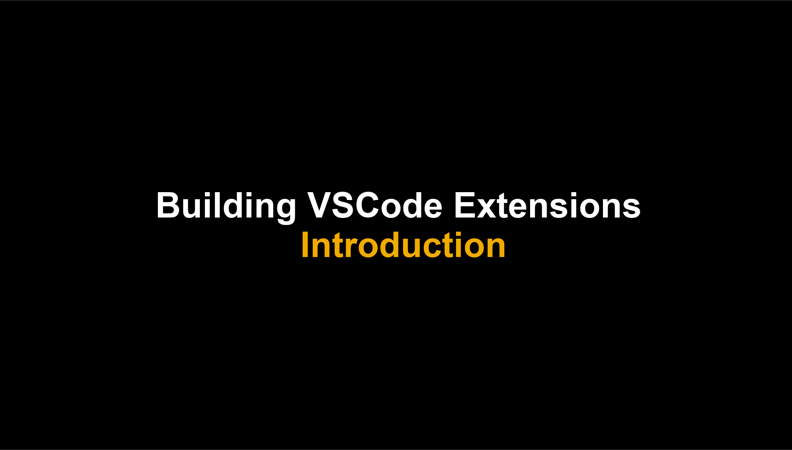
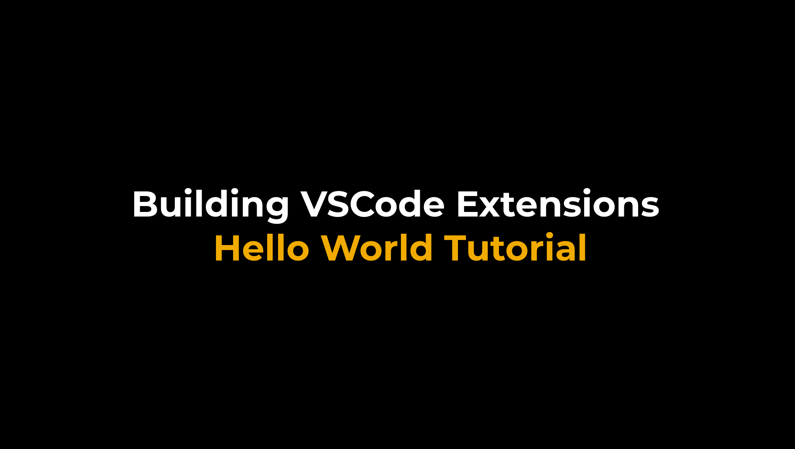
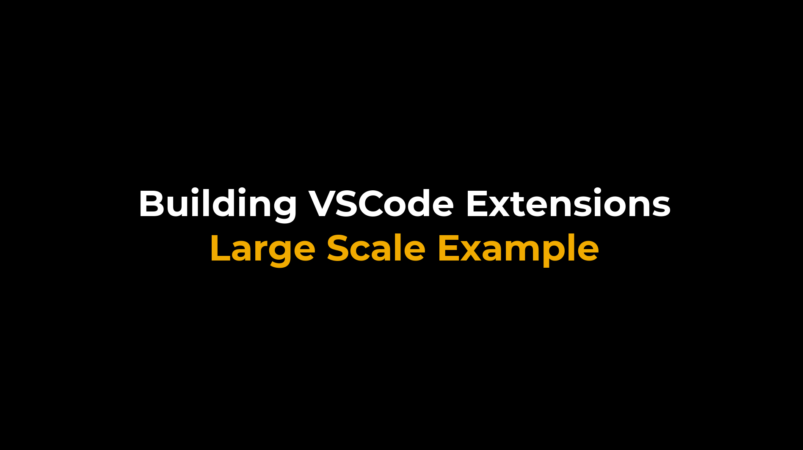

# Building VSCode Extensions

**This enablement content is part Devtoberfest Week 6 : Sep 28 - Oct 2.**

As we have seen over several weeks of sessions, the vast majority of the development experience is delivered via the Business Application Studio and/or VSCode.  The two have a close relationship sharing similar architecture, design and importantly the same approach to extensions.  This is how SAP is now able to develop new editors and development tools and deliver them to both Busienss Application Studio and VSCode.

In this topic's sessions we will look at how a VSCode extension is developed and how you can begin to create your own extensions.

All of the scheduled content described on this page is available in a [public Google Calendar](https://calendar.google.com/calendar?cid=Ym1ibGJucHFkOHMwcWZoYnZnMjJqazE3OWdAZ3JvdXAuY2FsZW5kYXIuZ29vZ2xlLmNvbQ) so that you can bring the events into your own calendar and get reminders for each of them. Alternatively, if you're subscribed to the [SAP Developers YouTube Channel](https://www.youtube.com/user/sapdevs) you can get reminder notifications for individual live stream and premiere videos.

## Parts

Here's what the premiere schedule looks like:

| Date / Time      | Mon 28 Sep        | Tue 29 Sep       | Wed 30 Sep      |
| ---------------- | ---------------- | --------------- | --------------- |
| 0400 EST (UTC-4) | | | [Building VSCode Extensions with Jhodel Cailan](https://youtu.be/qf4gLesSFqI) |
| 1800 EST (UTC-4) | [Introduction](https://youtu.be/vE-5RZkYOXo) | [Large Scale Example](https://youtu.be/VVRyRy9hFDw) |
| 1800 EST (UTC-4) | [Hello World Tutorial](https://youtu.be/aoR7q_d4KuE) |                 |  

| Video     | Description                                                 | Length   |
| --------- | ----------------------------------------------------------- | -------- |
|  | Introduction   Premieres on Mon 28 Sep at 1800 EST (UTC-4)  [ICS Download](https://sap-samples.github.io/sap-devtoberfest-2020/cal/vscode_intro.ics)  | 14 min |
|  | Hello World Tutorial   Premieres on Mon 28 Sep at 1815 EST (UTC-4)  [ICS Download](https://sap-samples.github.io/sap-devtoberfest-2020/cal/vscode_ex1.ics)  | 15 min |
|  | Large Scale Example   Premieres on Tue 29 Sep at 1800 EST (UTC-4)  [ICS Download](https://sap-samples.github.io/sap-devtoberfest-2020/cal/vscode_ex2.ics)  | 36 min |
| [Recording](https://youtu.be/qf4gLesSFqI) | Building VSCode Extensions with Jhodel Cailan  As part of the Devtoberfest week focusing on the topic of building VSCode Extensions, we will have this interactive interview and Q&A session with SAP Community member Jhodel Cailan https://twitter.com/CailanJhodel to discuss his experience building Blue Phoenix https://github.com/jcailan/vscode-blue-phoenix  Wednesday, September 30 at 1600 Singapore Standard Time (GMT+8) | [Recording](https://youtu.be/qf4gLesSFqI) |
