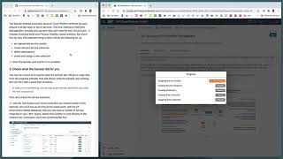
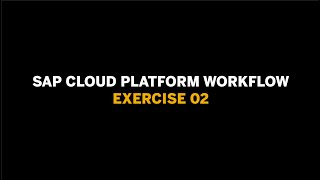
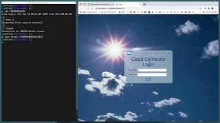
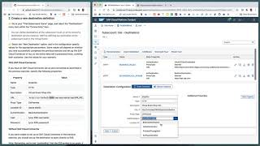
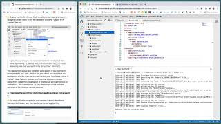
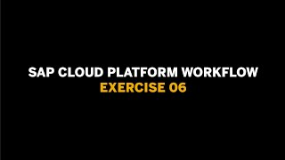
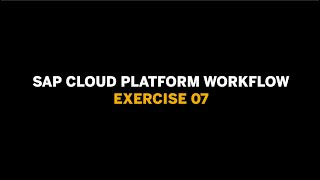
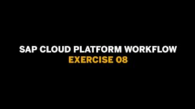
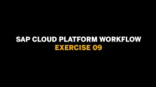
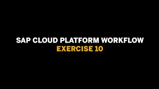

# SAP Cloud Platform Workflow

**This enablement content is for Devtoberfest Week 1 : 24 → 28 Aug 2020.**

Here you'll find content to help you level up with the [SAP Cloud Platform Workflow](https://help.sap.com/viewer/product/WORKFLOW_SERVICE/Cloud/en-US) service. This content consists of **exercises**, **videos** of those exercises, and **office hours** sessions. 

All of the scheduled content described on this page (the premieres and the office hours session) is available in a [public Google Calendar](https://calendar.google.com/calendar?cid=Ym1ibGJucHFkOHMwcWZoYnZnMjJqazE3OWdAZ3JvdXAuY2FsZW5kYXIuZ29vZ2xlLmNvbQ) so that you can bring the events into your own calendar and get reminders for each of them. Alternatively, if you're subscribed to the [SAP Developers YouTube Channel](https://www.youtube.com/user/sapdevs) you can get reminder notifications for individual live stream and premiere videos. 

## Exercises

We have a set of exercises that help you get to know the workflow service. They take you through a series of tasks, covering everything from setting the service and tools up in an SAP Cloud Platform trial account, through installing and configuring an SAP Cloud Connector, just in case you want to make service calls to on-prem systems, to creating your own workflow definitions, invoking them directly and also through the Workflow APIs.

You can follow these exercises yourself, at your own pace, using the resources in the [Virtual Event - SAP Cloud Platform Workflow](https://github.com/SAP-samples/cloud-platform-workflow-virtual-event/) repository. 

If you have any questions when doing the exercises for this topic, you can [create an issue](https://github.com/SAP-samples/sap-devtoberfest-2020/issues/new?assignees=&labels=question%2C+topic-workflow&template=exercise-question.md&title=Summarize+your+question+here) on this repository - please make sure you [use this issue template](https://github.com/SAP-samples/sap-devtoberfest-2020/issues/new?assignees=&labels=question%2C+topic-workflow&template=exercise-question.md&title=Summarize+your+question+here) with the labels 'topic-workflow' and 'question'. Thanks!

You may find it useful to browse the [closed issues tagged "topic-workflow"](https://github.com/SAP-samples/sap-devtoberfest-2020/issues?q=label%3Atopic-workflow+is%3Aclosed) for additional information. For example, a newly available one-click method of getting to the Workflow tools is described in [issue #32 Will the Workflow tools be available via a simpler route?](https://github.com/SAP-samples/sap-devtoberfest-2020/issues/32).

## Videos 

We've also recorded these exercises individually, for you to watch. We'll be airing them all for the first time on YouTube as [premieres](https://support.google.com/youtube/answer/9080341). Premieres are videos that appear initially on YouTube at a specific date and time, and the video author is usually there in the chat and available to answer questions on the content. 

For you, this means that you can set a reminder for the premieres to get notifications of when they're going live, and then join on YouTube to watch the content together, along with your fellow developers and friends, and also with the SAP Developer Advocate responsible. This means that you can chat live with them and ask questions during the event.

Don't worry if you can't make a premiere, though! After the premiere is over, the video will be available for anyone to watch at any time after that, just like a normal YouTube video (and it will keep the same URL). 

We've scheduled the premieres for the videos of these 10 exercises over 5 consecutive days in August - two a day, between Mon 24 Aug and Fri 28 Aug. They'll be at the same time on each of those days, contained in a one-hour block starting at 1100 BST (UTC+1). Note that each exercise video is less than 30 mins in length, meaning that we can use the time between the end of the first video and the start of the second (at 1130) to continue the chat if necessary.

Here's what the premiere schedule looks like:

| Date / Time | Mon 24 Aug | Tue 25 Aug | Wed 26 Aug | Thu 27 Aug | Fri 28 Aug |
| - | - | - | - | - | - |
| 1100 BST (UTC+1) | [Exercise 01](https://youtu.be/DyjM-VoRLjw) | [Exercise 03](https://youtu.be/JjiMA9gT8ss) | [Exercise 05](https://youtu.be/P4EVoc-lmAI) | [Exercise 07](https://youtu.be/TVirKnU86cw) | [Exercise 09](https://youtu.be/O0ye689G-1g) |
| 1130 BST (UTC+1) | [Exercise 02](https://youtu.be/tG_oUPs67CY) | [Exercise 04](https://youtu.be/47XVi1B2KyI) | [Exercise 06](https://youtu.be/SKfEfYOVQYA) | [Exercise 08](https://youtu.be/ZNg60jB8jik) | [Exercise 10](https://youtu.be/O0ye689G-1g) |

There's also a short (5 mins) video that gives [an introduction to the exercise content](https://youtu.be/KlNLbSxsM6s) that you can watch now or any time. 

## Office hours sessions

In case you have anything you want to ask or discuss, relating to the content here, we'll hold a couple of hour-long "office hours" sessions in the week following the video premieres, specifically on Wed 02 Sep. They will be in the form of Zoom meetings and scheduled to allow participation from most timezones:

- 0800 BST (UTC+1) → [Zoom meeting link](https://sap-se.zoom.us/j/95873935644) | [ICS Download](https://sap-samples.github.io/sap-devtoberfest-2020/cal/workflow_office_hours2.ics)
- 1400 BST (UTC+1) → [Zoom meeting link](https://sap-se.zoom.us/j/99812944506) | [ICS Download](https://sap-samples.github.io/sap-devtoberfest-2020/cal/workflow_office_hours1.ics)

These office hours sessions are also in the [public Google Calendar](https://calendar.google.com/calendar?cid=Ym1ibGJucHFkOHMwcWZoYnZnMjJqazE3OWdAZ3JvdXAuY2FsZW5kYXIuZ29vZ2xlLmNvbQ) mentioned earlier.

# The content - video & exercise links

| Video | Description | Video Length |
| - | - | - |
|  | [An introduction to the exercise content](https://github.com/SAP-samples/cloud-platform-workflow-virtual-event) | 05 mins |
|   | [Exercise 01 - Setting up for Workflow on SAP Cloud Platform](https://github.com/SAP-samples/cloud-platform-workflow-virtual-event/blob/master/exercises/01/readme.md)    [Premieres](https://youtu.be/DyjM-VoRLjw) on Mon 24 Aug at 1100 BST (UTC+1)  [ICS Download](https://sap-samples.github.io/sap-devtoberfest-2020/cal/workflow_ex1.ics) | 16 mins |
|  | [Exercise 02 - Deploying the Workflow tools](https://github.com/SAP-samples/cloud-platform-workflow-virtual-event/blob/master/exercises/02/readme.md)   [Premieres](https://youtu.be/tG_oUPs67CY) on Mon 24 Aug at 1130 BST (UTC+1)   [ICS Download](https://sap-samples.github.io/sap-devtoberfest-2020/cal/workflow_ex2.ics) | 18 mins |
|  | [Exercise 03 - Installing & configuring the SAP Cloud Connector](https://github.com/SAP-samples/cloud-platform-workflow-virtual-event/blob/master/exercises/03/readme.md)   [Premieres](https://youtu.be/JjiMA9gT8ss) on Tue 25 Aug at 1100 BST (UTC+1)   [ICS Download](https://sap-samples.github.io/sap-devtoberfest-2020/cal/workflow_ex3.ics) | 20 mins |
|  | [Exercise 04 - Establishing a destination in SAP Cloud Platform](https://github.com/SAP-samples/cloud-platform-workflow-virtual-event/blob/master/exercises/04/readme.md)   [Premieres](https://youtu.be/47XVi1B2KyI) on Tue 25 Aug at 1130 BST (UTC+1)   [ICS Download](https://sap-samples.github.io/sap-devtoberfest-2020/cal/workflow_ex4.ics) | 15 mins |
|  | [Exercise 05 - Creating, deploying & instantiating a simple workflow](https://github.com/SAP-samples/cloud-platform-workflow-virtual-event/blob/master/exercises/05/readme.md)   [Premieres](https://youtu.be/P4EVoc-lmAI) on Wed 26 Aug at 1100 BST (UTC+1)   [ICS Download](https://sap-samples.github.io/sap-devtoberfest-2020/cal/workflow_ex5.ics) | 19 mins |
|  | [Exercise 06 - Exploring the API Hub and the Workflow API](https://github.com/SAP-samples/cloud-platform-workflow-virtual-event/blob/master/exercises/06/readme.md)   [Premieres](https://youtu.be/SKfEfYOVQYA) on Wed 26 Aug at 1130 BST (UTC+1)   [ICS Download](https://sap-samples.github.io/sap-devtoberfest-2020/cal/workflow_ex6.ics) | 18 mins |
|  | [Exercise 07 - Calling the Workflow API from Postman](https://github.com/SAP-samples/cloud-platform-workflow-virtual-event/blob/master/exercises/07/readme.md)   [Premieres](https://youtu.be/TVirKnU86cw) on Thu 27 Aug at 1100 BST (UTC+1)   [ICS Download](https://sap-samples.github.io/sap-devtoberfest-2020/cal/workflow_ex7.ics) | 11 mins |
|  | [Exercise 08 - Adding a Service Task to the workflow definition](https://github.com/SAP-samples/cloud-platform-workflow-virtual-event/blob/master/exercises/08/readme.md)   [Premieres](https://youtu.be/ZNg60jB8jik) on Thu 27 Aug at 1130 BST (UTC+1)   [ICS Download](https://sap-samples.github.io/sap-devtoberfest-2020/cal/workflow_ex8.ics) | 09 mins |
|  | [Exercise 09 - Adding a User Task to the workflow definition](https://github.com/SAP-samples/cloud-platform-workflow-virtual-event/blob/master/exercises/09/readme.md)   [Premieres](https://youtu.be/O0ye689G-1g) on Fri 28 Aug at 1100 BST (UTC+1)   [ICS Download](https://sap-samples.github.io/sap-devtoberfest-2020/cal/workflow_ex9.ics) | 14 mins |
|  | [Exercise 10 - Accessing contextual information in a Script Task](https://github.com/SAP-samples/cloud-platform-workflow-virtual-event/blob/master/exercises/10/readme.md)   [Premieres](https://youtu.be/UDF1xHUpL2Y) on Fri 28 Aug at 1130 BST (UTC+1)   [ICS Download](https://sap-samples.github.io/sap-devtoberfest-2020/cal/workflow_ex10.ics) | 09 mins |
